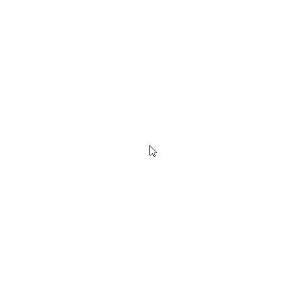
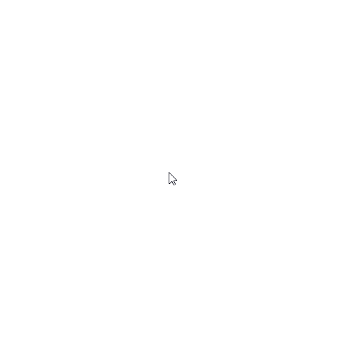
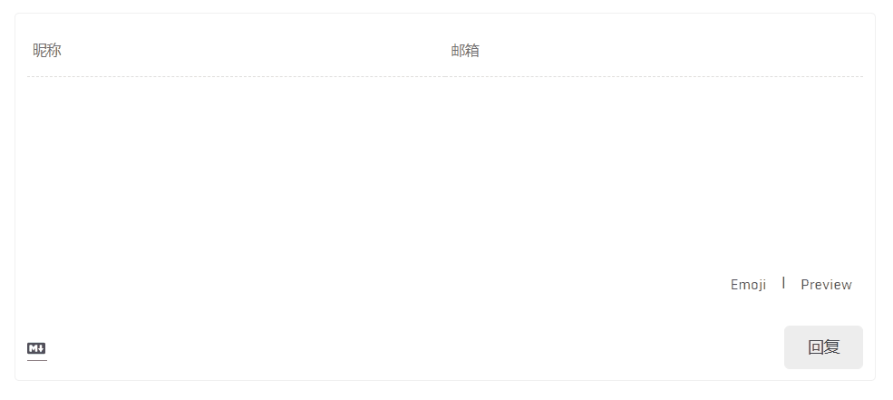

## Star's Tech Blog

框架驱动：[Hexo](https://hexo.io/zh-cn/)  

博客主题：[NexT ^6.x](https://github.com/theme-next/hexo-theme-next)

## 博客搭建与配置

### 环境准备

- [Node.js](http://nodejs.org/)

- [Git](http://git-scm.com/)

### Hexo 搭建

安装 Hexo，打开 Git Bash 命令窗口，输入命令：

```bash
npm install -g hexo-cli
```
安装好 Hexo 后，在任意目录新建一个空文件夹，名字可以为 blogs，然后进入这个文件夹，在命令行输入命令：

```bash
hexo init 
```
执行完成后（如果命令窗口出现橙色的 WARN 不用管），生成文件结构：

```bash
├── node_modules       //依赖安装目录
├── scaffolds          //模板文件夹，新建的文章将会从此目录下的文件中继承格式
|   ├── draft.md         //草稿模板
|   ├── page.md          //页面模板
|   └── post.md          //文章模板
├── source             //资源文件夹，用于放置图片、数据、文章等资源
|   └── _posts           //文章目录
├── themes             //主题文件夹
|   └── landscape        //默认主题
├── .gitignore         //指定不纳入git版本控制的文件
├── _config.yml        //站点配置文件
├── db.json            
├── package.json
└── package-lock.json
```
下载依赖包，输入命令：

```bash
npm install
```
依赖包下载完成后，输入如下命令启动 hexo 的内置 Web 服务器：

```bash
hexo g // 打包文件

hexo s // 启动服务器
```

然后可以在在浏览器中通过地址 http://localhost:4000/ 访问博客了。

### 更换 NexT 主题

Hexo 更换主题的方式很简单，只需要将主题文件拷贝至根目录下的 themes 目录中， 然后修改根目录下 `_config.yml` 文件中的 theme 字段，便可完成更换。

在博客项目的根目录下，输入命令：

```bash
git clone https://github.com/theme-next/hexo-theme-next.git themes/next
```
打开根目录下 `_config.yml` 文件,将 theme 字段的值修改为 next。

```yml
# Extensions
## Plugins: https://hexo.io/plugins/
## Themes: https://hexo.io/themes/
theme: next
```

这个时候需要重启服务器 `hexo g && hexo s` 并刷新才能使主题生效。

### 部署到 GitHub Pages

在项目根目录下，安装 Git 部署插件：
```bash
npm install hexo-deployer-git --save
```


### 重要定义

在项目文件中存在两个 `_config.yml` 文件，为了方便区分。

- 项目根目录下的 `_config.yml` 文件叫作`站点配置文件`。

- 主题文件夹根目录下的 `themes/next/_config.yml` 文件叫作`主题配置文件`。

### 站点配置

站点配置可以查看 Hexo 官方文档。

Hexo 官方文档：https://hexo.io/zh-cn/docs/configuration.html 。

**注意**：所有的 `:` 都为英文字符，后面必须有一个空格。

### 主题配置  

NexT 的主题配置可以先查看官方文档，写得很不错，很完善。

NexT 官方文档：http://theme-next.iissnan.com/getting-started 。

NexT （最新）官方文档：https://theme-next.org/docs/getting-started/ 。

### 第三方配置

**鼠标点击特效**

从各个站点里收集了以下四个比较常用的鼠标点击特效：

- 礼花特效

  

下载：[礼花特效](asset/js/firework.js)

- 爆炸特效

  

下载：[爆炸特效](asset/js/explosion.min.js)

- 浮出爱心

  

下载：[浮出爱心](asset/js/love.min.js)

- 浮出文字

  

下载：[浮出文字](asset/js/text.js)


将脚本文件放置于 `themes/next/source/js/cursor` 目录下（如果没有相应的目录，需要自行创建，可以根据自己习惯命名）。

在主题自定义布局文件 `themes/next/layout/_custom/custom.swig` （如果没有 custom.swig 文件，需自行创建）中添加如下代码：

```js
{# 鼠标点击特效 #}

  <script async src="/js/cursor/fireworks.js"></script>

  <canvas class="fireworks" style="position: fixed;left: 0;top: 0;z-index: 1; pointer-events: none;" ></canvas>
  <script src="//cdn.bootcss.com/animejs/2.2.0/anime.min.js"></script>
  <script async src="/js/cursor/explosion.min.js"></script>

  <script async src="/js/cursor/love.min.js"></script>

  <script async src="/js/cursor/text.js"></script>

```

在 `themes/next/layout/_layout.swig` 文件 body 标签中添加如下代码：

```js
    ...
    
  </body>
</html>
```

在主题配置文件 `themes/next/_config.yml` 中添加如下代码：

```yml
# mouse click effect: fireworks | explosion | love | text 
  cursor_effect: love
```

**打字特性**

- 打字礼花



下载：[打字礼花](asset/js/activate-power-mode.min.js)  

将脚本文件放置到 `themes/next/source/js` 目录下。

在主题自定义配置 `themes/next/layout/_custom/custom.swig` 文件中添加如下代码：

```js

  <script async src="/js/activate-power-mode.min.js"></script>
  <script>
    POWERMODE.colorful = {{ theme.typing_effect.colorful }};
    POWERMODE.shake = {{ theme.typing_effect.shake }};
    document.body.addEventListener('input', POWERMODE);
  </script>

```

在主题配置文件 `themes/next/_config.yml` 中添加如下代码：

```yml
# typing effect
typing_effect:
  colorful: true  # 礼花特效
  shake: false  # 震动特效
```

在 `themes/next/layout/_layout.swig` 文件 body 标签中添加如下代码：

```js
    ...
    
  </body>
</html>
```

**网站运行时间**

在主题自定义配置 `themes/next/layout/_custom/custom.swig` 文件中添加如下代码：

```js
{# 页脚站点运行时间统计 #}

  <script src="https://cdn.jsdelivr.net/npm/moment@2.22.2/moment.min.js"></script>
  <script src="https://cdn.jsdelivr.net/npm/moment-precise-range-plugin@1.3.0/moment-precise-range.min.js"></script>
  <script>
    function timer() {
      var ages = moment.preciseDiff(moment(),moment({{ theme.footer.site_runtime.since }},"YYYYMMDD"));
      ages = ages.replace(/years?/, "年");
      ages = ages.replace(/months?/, "月");
      ages = ages.replace(/days?/, "天");
      ages = ages.replace(/hours?/, "小时");
      ages = ages.replace(/minutes?/, "分");
      ages = ages.replace(/seconds?/, "秒");
      ages = ages.replace(/\d+/g, '<span style="color:{{ theme.footer.site_runtime.color }}">$&</span>');
      div.innerHTML = `{{ __('footer.site_runtime')}} ${ages}`;
    }
    var div = document.createElement("div");
    //插入到copyright之后
    var copyright = document.querySelector(".copyright");
    document.querySelector(".footer-inner").insertBefore(div, copyright.nextSibling);
    timer();
    setInterval("timer()",1000)
  </script>

```

在 `themes/next/layout/_layout.swig` 文件 body 标签中添加如下代码：

```js
    ...
    
  </body>
</html>
```

在主题主题配置文件 `themes/next/_config.yml` 中添加如下内容：

```yml
  footer:
    ...
   # Web Site runtime 
+  site_runtime: 
+  enable: true 
   # Specify the date when the site was setup
+  since: 20191124
   # color of number
+  color: "#1890ff"
```

然后在文件 `themes\next\languages\zh-CN.yml` 中补全对应文案：

```yml
  footer:
    powered: "由 %s 强力驱动"
    theme: 主题
    # total_views: 总访问量
    # total_visitors: 总访客量
    total_views: "历经 %s 次回眸才与你相遇"
    total_visitors: "我的第 %s 位朋友"
+   site_runtime: "我已在此等候你"
```

**文章阅读量 - LeanCloud** 

LeanCloud 能够给每篇博客统计访问量的工具。首先注册并登录 LeanCloud。  

LeanCloud 官网：https://www.leancloud.cn/ 。

- LeanCloud 应用配置

参考：https://github.com/theme-next/hexo-theme-next/blob/master/docs/zh-CN/LEANCLOUD-COUNTER-SECURITY.md

- hexo-leancloud-counter-security 插件安装与配置

参考：https://github.com/theme-next/hexo-leancloud-counter-security


**评论系统 - Valine**

Valine 是一款基于 Leancloud 的快速，简单和高效的无后端评论系统。

Valine 官网：https://valine.js.org/ 。

配置参考：https://theme-next.org/docs/third-party-services/comments#Valine


**百度统计**

登录[百度统计](https://tongji.baidu.com/)， 定位到站点的代码获取页面。  
复制 hm.js? 后面那串统计脚本 id，如图：   


编辑`主题配置文件`，修改字段 `baidu_analytics`, 字段值设置成你的百度统计脚本 id。

```yml
# Baidu Analytics
baidu_analytics: # <app_id>
```

**收录**

- 百度收录

- Google Search Console


**代码压缩**

- gulp


### 参考

https://juejin.im/post/5dd2e898e51d45400206a466#heading-0

https://juejin.im/post/5bebfe51e51d45332a456de0#heading-0

https://hexo-guide.readthedocs.io/zh_CN/latest/index.html

